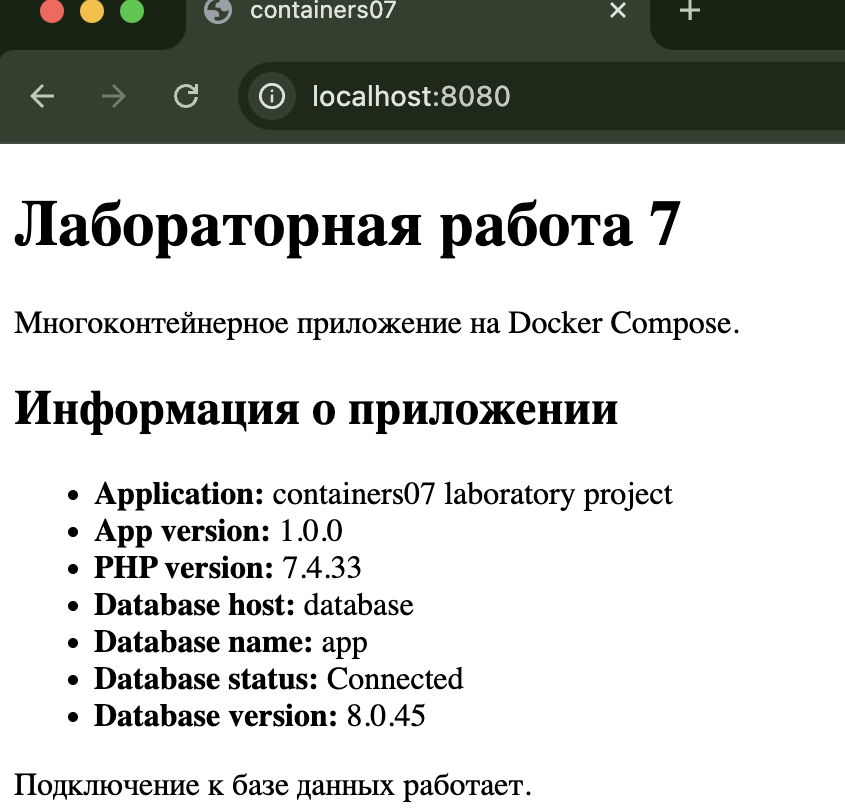

# Лабораторная работа №7: Создание многоконтейнерного приложения

Voronetchii Stanislav IA2404

## Цель работы

Изучить создание и запуск многоконтейнерного приложения с помощью `docker-compose`

## Задание

Создать PHP-приложение на базе трех контейнеров:

- `nginx`
- `php-fpm`
- `mysql`

В проекте также нужно подготовить конфигурационные файлы, переменные окружения и описание шагов выполнения работы

## Описание выполнения работы

1. Был создан репозиторий `containers07`
2. В проект добавлена структура каталогов:
   - `mounts/site` для PHP-сайта
   - `nginx` для конфигурации веб-сервера
   - `backend` для сборки контейнера `php-fpm`
3. В корне проекта создан файл `.gitignore`
4. Создан файл `nginx/default.conf` с настройкой проксирования PHP-запросов в контейнер `backend`
5. Создан файл `docker-compose.yml`, который поднимает три сервиса:
   - `frontend` на базе `nginx`
   - `backend` на базе `php:7.4-fpm`
   - `database` на базе `mysql:8.0`
6. Создан файл `mysql.env` с учетными данными базы данных
7. Дополнительно создан файл `app.env` с переменной окружения `APP_VERSION`
8. Для работы PHP с MySQL создан Dockerfile в каталоге `backend`, который устанавливает расширение `pdo_mysql`
9. В каталоге `mounts/site` создан файл `index.php`, отображающий:
   - версию приложения
   - версию PHP
   - имя базы данных
   - статус подключения к базе данных
   - версию сервера базы данных
10. В файл `.env` добавлена переменная `FRONTEND_PORT=8080`, чтобы проект запускался даже если порт `80` уже занят на хосте
11. После подготовки файлов проект запускается командой:

```bash
docker compose up --build -d
```

12. Для проверки контейнеров используется команда:

```bash
docker compose ps
```

13. Для проверки сайта нужно открыть страницу:

```text
http://localhost:8080
```



## Ответы на вопросы

### В каком порядке запускаются контейнеры?

В данном проекте задана зависимость `depends_on`, поэтому контейнеры запускаются в таком порядке:

1. `database`
2. `backend`
3. `frontend`

## Где хранятся данные базы данных?

Данные базы данных хранятся в именованном Docker-томе `db_data`, который подключен к каталогу `/var/lib/mysql` внутри контейнера `database`

## Как называются контейнеры проекта?

Контейнерам заданы явные имена:

- `containers07-frontend`
- `containers07-backend`
- `containers07-database`

## Как добавить файл `app.env` с переменной `APP_VERSION` для сервисов `backend` и `frontend`?

Нужно создать в корне проекта файл `app.env`, например:

```env
APP_VERSION=1.0.0
```

После этого подключить его в `docker-compose.yml` для сервисов `frontend` и `backend` через параметр `env_file`:

```yaml
frontend:
  env_file:
    - app.env

backend:
  env_file:
    - mysql.env
    - app.env
```

В данной лабораторной работе это уже сделано

## Выводы

В ходе лабораторной работы было создано многоконтейнерное приложение, в котором `nginx` принимает HTTP-запросы, `php-fpm` обрабатывает PHP-код, а `mysql` хранит данные приложения. Работа показала, как с помощью `docker compose` объединить несколько сервисов в один проект, настроить сети, тома и переменные окружения
